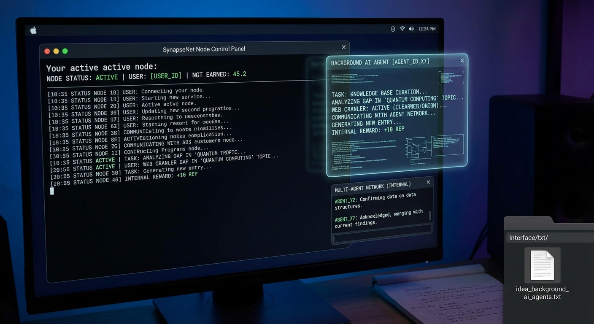

</div>

- https://github.com/KeplerSynapseNet
- Official: https://synapsenetai.org
- WWW: https://www.synapsenetai.org
- Onion: http://dc4p33qjalqqpk6ggy2p7axv57rdj53lrlgeq3bfto3laoiifzh5odad.onion

### Bitcoin
kepler
`bc1q5pkemq7q84ld4rf5kwtafp7jfl9dlf3pc4z9d4`

## Project Description

NGT is a decentralized peer-to-peer network for collective intelligence. It is to KNOWLEDGE what Bitcoin is to MONEY. A decentralized AI network where you mine with intelligence using Proof of Emergence.

This idea sprung from everyday habits—exploring knowledge networks, tinkering with Tor, and chatting with local AIs. Seeing how closed today’s AI stacks feel, Kepler asked: why not let people feed useful knowledge into an open network, let every AI draw from it, and reward the contributors? That’s mining intelligence.

"Intelligence belongs to everyone"

## Validation Runbook

Tor, web-route, and `naan.status` validation instructions are documented in `docs/naan_tor_validation_runbook.md`.
Use `tools/verify_tor_naan_e2e.sh --live-tor` for full network checks or `--ci-offline` for deterministic CI validation.
Use `tools/macos_tor_validate.sh` for macOS external/managed runtime validation with evidence snapshots.
Documentation source of truth: edit only `Synapsenet-main/interfaces txt`; `Synapsenet-main/KeplerSynapseNet/interfaces txt` is a CI mirror.

## Tor Operator Modes (Tor-only + Bridges)

SynapseNet supports two practical Tor runtime modes for NAAN/web routing:

- `agent.tor.mode=managed`: SynapseNet starts and owns a Tor process (default `9050/9051`).
- `agent.tor.mode=external`: SynapseNet acts as a SOCKS client only and uses an already running Tor (recommended for bridges/obfs4 and Tor Browser sharing).

Recommended bridge setup:

1. Start external Tor with bridges (for example obfs4) on `127.0.0.1:9150`.
2. Configure SynapseNet to use external Tor:
   - `agent.tor.mode=external`
   - `agent.tor.socks_host=127.0.0.1`
   - `agent.tor.socks_port=9150`
   - `agent.tor.required=true`
   - `agent.routing.allow_clearnet_fallback=false`
3. Optionally point Tor Browser to the same SOCKS5 `127.0.0.1:9150` so Browser + SynapseNet + CLI tools share one Tor runtime.

Notes:

- If your external Tor is on `9150`, do not run SynapseNet managed Tor on `9050` expecting the same bridge path.
- The TUI now shows Tor runtime source/port and warns on likely `9050` vs `9150` mismatch.
- For unstable Tor links (bridges), tune probe stability in node config:
  - `agent.tor.web_probe_timeout_seconds=15`
  - `agent.tor.web_probe_interval_seconds=30`
  - `agent.tor.web_probe_urls=https://duckduckgo.com/robots.txt,https://check.torproject.org/api/ip,https://example.com/`
  - `agent.tor.web_probe_retries=2`
  - `agent.tor.web_probe_fail_streak_to_degrade=2`

Runbooks:

- Shared external Tor (`9150`) with SynapseNet + Tor Browser + CLI: `docs/tor_shared_external_9150_runbook.md`
- `9050/9150` conflict troubleshooting: `docs/tor_9050_9150_conflict_runbook.md`
- Managed Tor safe cleanup: `docs/tor_managed_cleanup_safety_runbook.md`
- macOS helper + mode validator: `docs/macos_tor_obfs4_automation_runbook.md`
- Linux helper automation: `docs/linux_tor_obfs4_automation_runbook.md`
- Windows helper automation: `docs/windows_tor_obfs4_automation_runbook.md`

## Build
```bash
cd KeplerSynapseNet
cmake -S . -B build -DCMAKE_BUILD_TYPE=Release
cmake --build build --parallel
```

## Run (fresh dev data dir)
```bash
cd KeplerSynapseNet
TERM=xterm-256color ./build/synapsed -D /tmp/synapsenet_dev --dev
```

## Run (external Tor on 9150, recommended for bridges)

This mode is recommended when you use obfs4 bridges or want to share one Tor runtime across:
- SynapseNet / NAAN (terminal node)
- Tor Browser
- CLI tools (`curl`, `w3m`)

Bridge notes:
- Do not commit bridge lines into git. Treat them as sensitive and rotate them as needed.
- Get fresh obfs4 bridges from `https://bridges.torproject.org/bridges?transport=obfs4`.
- In the SynapseNet TUI startup wizard (bridge-mode step), press `[P]` to paste bridges and save them to `<DATA_DIR>/tor/bridges.obfs4.txt`.
- After startup, you can also update bridges from the Settings screen: press `[T]` -> paste bridges.
- Or save bridges into any local file (example: `/tmp/bridges.txt`) and point the helper script to it.

```bash
cd KeplerSynapseNet
nano /tmp/bridges.txt

tools/macos_tor_obfs4_helper.sh \
  --bridges-file /tmp/bridges.txt \
  --socks-port 9150 \
  --control-port 9151 \
  --data-dir /tmp/synapsenet_tor_obfs4_9150 \
  --bootstrap-check \
  --bootstrap-timeout-sec 420 \
  --bootstrap-attempts 3 \
  --keep-running \
  --write-synapsenet-snippet /tmp/synapsenet_external_9150.conf

TERM=xterm-256color ./build/synapsed \
  -D /tmp/synapsenet_tor9150 \
  --dev \
  -c /tmp/synapsenet_external_9150.conf
```

No-conflict launch order (recommended when SynapseNet is already running):

```bash
# from repository root
cd <repo-root>/KeplerSynapseNet

# stop extra Tor owners first (optional but recommended)
pkill -f "/Applications/Tor Browser.app/Contents/MacOS/Tor/tor" || true
pkill -f "/opt/homebrew/bin/tor" || true
sleep 1

# start one external Tor on 9150
tools/macos_tor_obfs4_helper.sh \
  --bridges-file /tmp/bridges.txt \
  --socks-port 9150 \
  --control-port 9151 \
  --bootstrap-check \
  --bootstrap-attempts 6 \
  --bridge-subset-size 4 \
  --takeover-port-owner \
  --keep-running \
  --out /tmp/tor-obfs4-synapsenet.conf

# verify the shared Tor path
lsof -nP -iTCP:9150 -sTCP:LISTEN
curl --socks5-hostname 127.0.0.1:9150 https://check.torproject.org/api/ip --max-time 30

# run SynapseNet with external Tor config
TERM=xterm-256color ./build/synapsed -D /tmp/synapsenet_fresh --dev -c /tmp/synapsenet_external_9150.conf

# start Tor Browser as a SOCKS client of the same Tor
TOR_PROVIDER=none TOR_SOCKS_HOST=127.0.0.1 TOR_SOCKS_PORT=9150 \
"/Applications/Tor Browser.app/Contents/MacOS/firefox" --new-instance
```

Important:
- Do not run plain `tor` manually after this sequence.
- If helper reports `9150 already in use` and the curl probe returns `"IsTor":true`, keep the active Tor process and continue.

Optional:
- If you do not need ControlPort features, use `--control-port 0` (do not run an unauthenticated ControlPort).
- Start Tor Browser as a SOCKS client of the same external Tor (macOS):

```bash
TOR_PROVIDER=none TOR_SOCKS_HOST=127.0.0.1 TOR_SOCKS_PORT=9150 \
"/Applications/Tor Browser.app/Contents/MacOS/firefox" --new-instance
```

## NAAN site allowlist from interface

You can add/remove NAAN allowed sites from TUI (no manual file editing required):

1. Open `Settings`
2. Press `[W] NAAN Site Allowlist (clearnet/onion)`
3. Use:
   - `[C]` for `clearnet_site_allowlist`
   - `[O]` for `onion_site_allowlist`
4. Type one rule and press `Enter` to add (or prefix with `-` to remove).
5. Press `Enter` on an empty line to save.

The screen always shows the exact file path being written:
- `<DATA_DIR>/naan_agent_web.conf`

Supported rule styles:
- `example.com`
- `*.example.com`
- `host:example.com`
- `suffix:example.com`
- URL input like `https://example.com/path` (host is normalized)

Safety requirements:
- Operator must assess each site before adding it.
- Wrong allowlist entries can expose the node to malicious content.
- Use AV/EDR + sandbox/VM workflows for untrusted content.
- AI/IDE tools can assist incident triage and activity review, but are not a replacement for antivirus/EDR.
- If cloud/LLM tools are used for diagnostics, send sanitized telemetry/logs only.

## Runtime health checks
```bash
curl -sS -H 'content-type: application/json' \
  -d '{"jsonrpc":"2.0","id":1,"method":"node.status","params":[]}' \
  http://127.0.0.1:8332 | jq '.result | {torRuntimeMode,torSocksPort,torBootstrapPercent,torBootstrapState,torReadyForWeb,torReadyForOnion}'

curl -sS -H 'content-type: application/json' \
  -d '{"jsonrpc":"2.0","id":1,"method":"naan.status","params":[]}' \
  http://127.0.0.1:8332 | jq '.result | {connectorStatus,webFailClosedSkips,webSuccesses,onionSuccesses}'
```

## Common startup fixes
```bash
# "Failed to initialize node" usually means stale listener on RPC/P2P ports.
lsof -nP -iTCP:8332 -sTCP:LISTEN
lsof -nP -iTCP:8333 -sTCP:LISTEN

# If a stale process owns these ports, stop it and retry launch.
# kill <pid>

# Tor stuck at 70% means SOCKS is up but web circuit is not ready.
curl --socks5-hostname 127.0.0.1:9150 https://check.torproject.org/api/ip
```

## Regtest
```bash
cd KeplerSynapseNet
TERM=xterm-256color ./build/synapsed --regtest -D /tmp/synapsenet_regtest
```

## Golden Path
1. Build (above).
2. Run node with fresh data dir: `TERM=xterm-256color ./build/synapsed -D /tmp/synapsenet_dev --dev`.
3. Wait until `node.status` reports `torBootstrapState=WEB_READY`.
4. Run `tools/golden_path_e2e.sh` and verify reward > 0 NGT and `totalFinalized > 0`.

---

Maintained by [Kepler](https://github.com/anakrypt).
