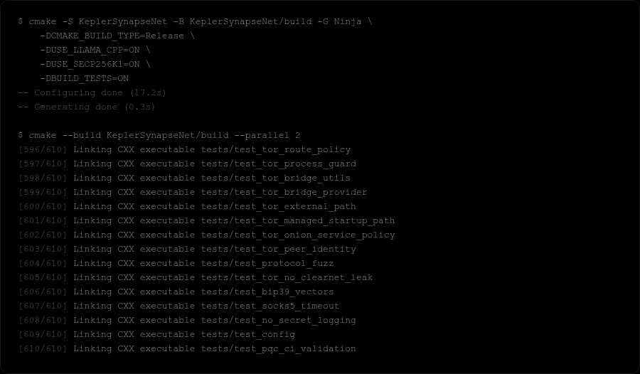
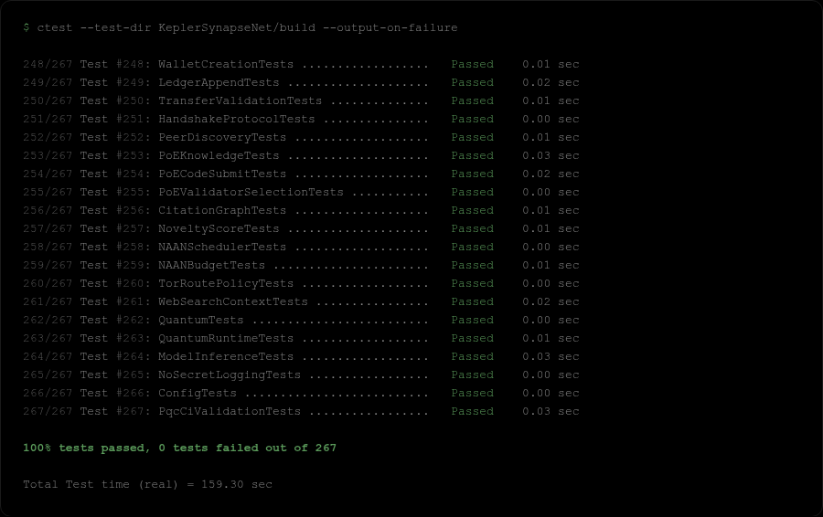
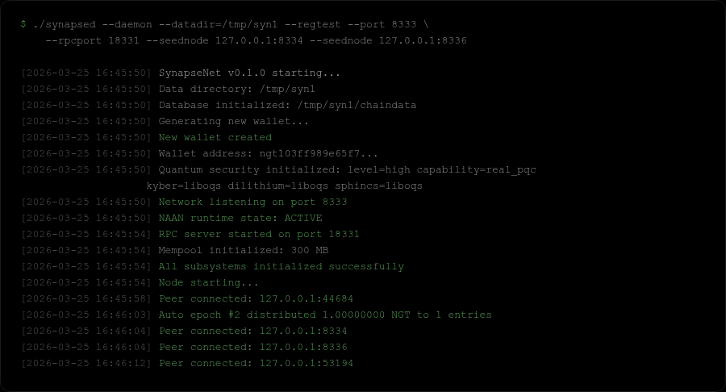
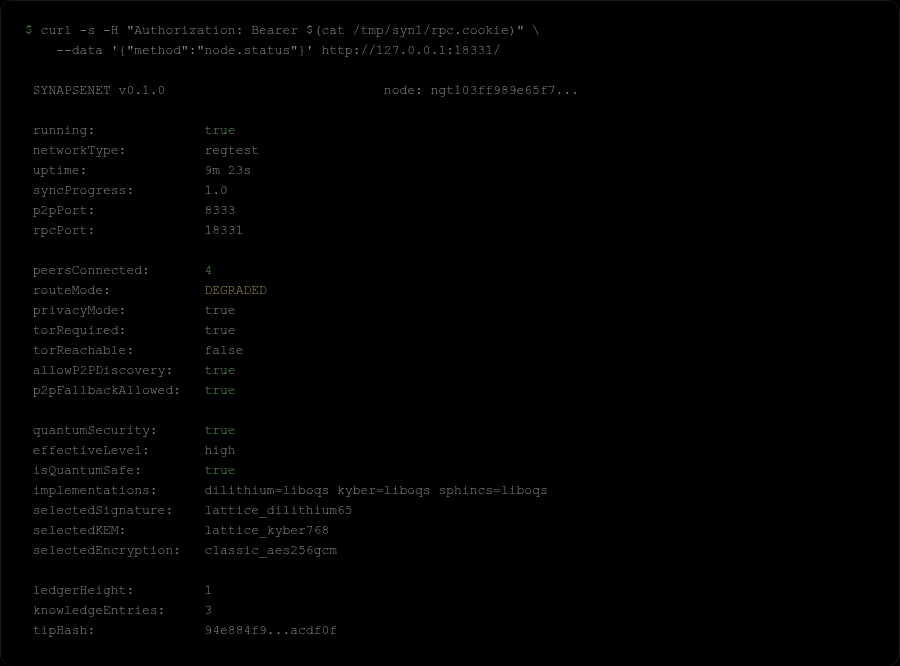
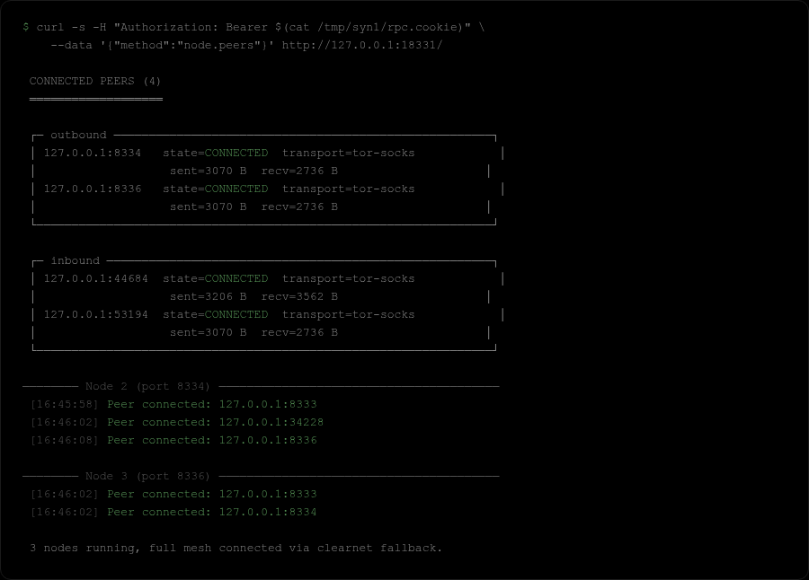
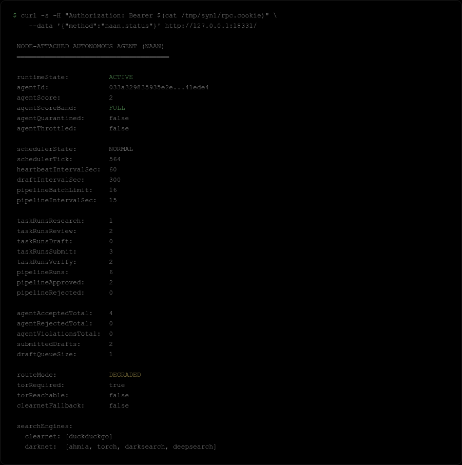
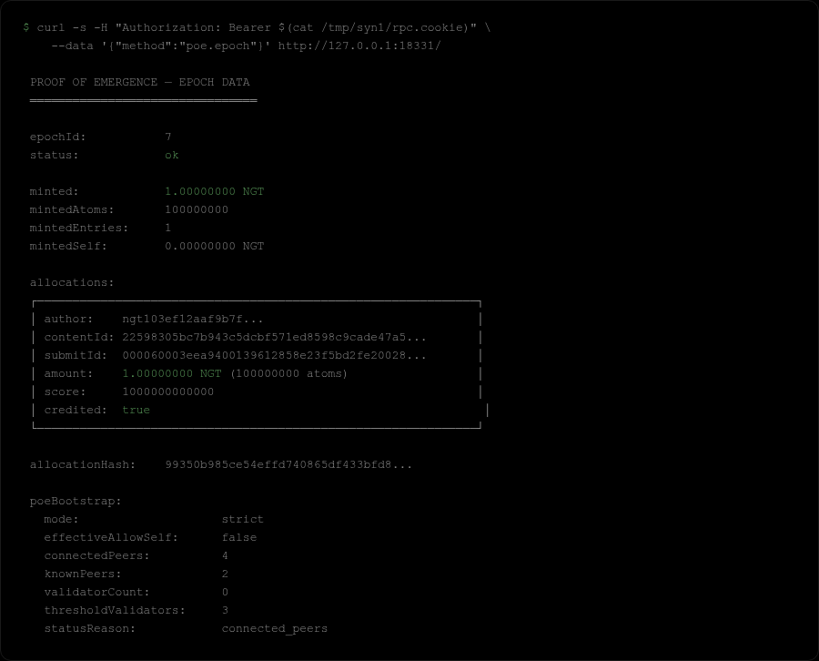
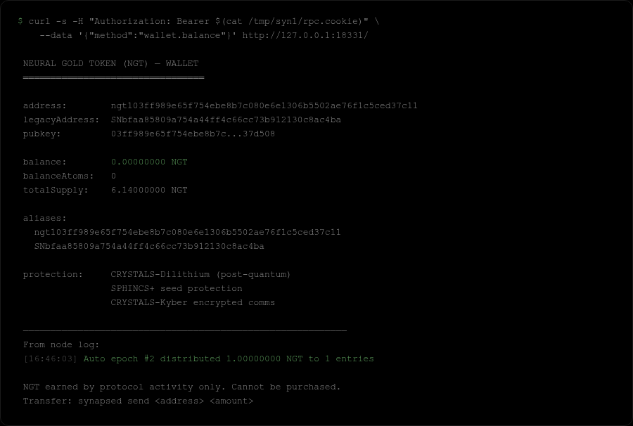

<h1 align="center">SynapseNet 0.1.0-alpha</h1>

<p align="center"><strong>First Public Release — Local Build, Local Mine, Local Network</strong></p>

<p align="center">
  
  
  
</p>

<p align="center">
  <a href="https://github.com/anakrypt"></a>
  <a href="https://github.com/anakrypt/Synapsenetai"></a>
  <a href="https://github.com/anakrypt/SynapseNet"></a>
  <a href="https://github.com/anakrypt/SynapseNet/blob/main/SynapseNet_Whitepaper.pdf"></a>
  <a href="https://github.com/anakrypt/Synapsenetai/tree/main/RELEASES/0.1.0-alphaV2"></a>
  <a href="https://github.com/anakrypt/Synapsenetai/tree/main/RELEASES/0.1.0-alphaV3"></a>
  <a href="https://github.com/anakrypt/Synapsenetai/tree/main/RELEASES"></a>
</p>

---

> This is the alpha release. You can build it, run it locally, spin up a multi-node devnet on your own machine, and see everything working end-to-end. There is no public network yet — seed nodes are not live. The interface is terminal-only. A proper graphical interface is the next milestone.

---

## Build

<p align="center">
  
</p>

```bash
# dependencies (Ubuntu/Debian)
sudo apt-get install build-essential cmake ninja-build libssl-dev libncurses-dev libsqlite3-dev

# clone
git clone https://github.com/anakrypt/Synapsenetai.git
cd Synapsenetai

# configure
cmake -S KeplerSynapseNet -B KeplerSynapseNet/build -G Ninja \
  -DCMAKE_BUILD_TYPE=Release \
  -DUSE_LLAMA_CPP=ON \
  -DUSE_SECP256K1=ON \
  -DBUILD_TESTS=ON

# build (610 targets)
cmake --build KeplerSynapseNet/build --parallel $(nproc)
```

**macOS:**
```bash
brew install cmake ninja openssl ncurses sqlite
cmake -S KeplerSynapseNet -B KeplerSynapseNet/build -G Ninja \
  -DCMAKE_BUILD_TYPE=Release \
  -DUSE_LLAMA_CPP=ON \
  -DUSE_SECP256K1=ON \
  -DBUILD_TESTS=ON \
  -DOPENSSL_ROOT_DIR=$(brew --prefix openssl)
cmake --build KeplerSynapseNet/build --parallel $(sysctl -n hw.ncpu)
```

---

## Tests

<p align="center">
  
</p>

```bash
ctest --test-dir KeplerSynapseNet/build --output-on-failure
```

267 tests. Cryptographic primitives (secp256k1, Ed25519, CRYSTALS-Dilithium, SPHINCS+, Kyber), wallet creation, ledger operations, peer discovery, PoE consensus, NAAN scheduling, Tor routing policy, protocol fuzzing, secret leak detection.

All pass. Zero failures.

---

## Start the Node

<p align="center">
  
</p>

```bash
TERM=xterm-256color ./KeplerSynapseNet/build/synapsed
```

The node initializes quantum-resistant cryptography, loads (or creates) your wallet, starts the local AI engine, binds P2P on port 8333, and begins peer discovery. Peers connect automatically via `--seednode` and peer exchange protocol.

First run creates a 24-word BIP39 seed phrase and a wallet file at `~/.synapsenet/wallet.dat`. Write the seed phrase down on paper. It is the only way to recover your wallet.

---

## Dashboard

<p align="center">
  
</p>

The node status dashboard showing real data from a running regtest node. 4 peers connected, quantum security active (Dilithium + Kyber + SPHINCS+), P2P discovery enabled, ledger synced.

| Key | Action |
|-----|--------|
| `1-9` | Dashboard screens |
| `0` | Agent Network observatory |
| `A` | NAAN agent status |
| `Tab` | Model panel |
| `F4` | Download a GGUF model |
| `F5` | Toggle web injection |
| `F6` | Toggle onion sources |
| `F7` | Toggle Tor for clearnet |
| `I` | Launch Terminal IDE |
| `F3` | Clear chat |
| `F8` | Stop generation |
| `Q` | Quit |

---

## Local Devnet — 3 Nodes

<p align="center">
  
</p>

Three nodes running locally, full mesh connected. Each node discovers and connects to the other two via `--seednode` and peer exchange. The screenshot shows real RPC output — 4 peer connections (2 outbound, 2 inbound), all state=CONNECTED.

```bash
# node 1
./synapsed --port 8333 --rpcport 18331 --datadir=~/.syn1 --regtest \
  --seednode 127.0.0.1:8334 --seednode 127.0.0.1:8336

# node 2
./synapsed --port 8334 --rpcport 18332 --datadir=~/.syn2 --regtest \
  --seednode 127.0.0.1:8333 --seednode 127.0.0.1:8336

# node 3
./synapsed --port 8336 --rpcport 18333 --datadir=~/.syn3 --regtest \
  --seednode 127.0.0.1:8333 --seednode 127.0.0.1:8334
```

Each node runs its own wallet, its own NAAN agent, and its own copy of the knowledge chain. Peer discovery uses DNS seeds in mainnet mode; in `--regtest` mode, nodes find each other through `--seednode` and peer exchange.

**Peer discovery mechanisms:**
1. DNS seeds (`seed1-5.synapsenet.io`) — mainnet, not live yet
2. Bootstrap direct connections — same seed hostnames
3. Peer exchange (`getpeers`/`peers` messages every 30s)

---

## NAAN — Node-Attached Autonomous Agent

<p align="center">
  
</p>

Every node runs a background AI agent. One node, one agent. The agent belongs to the network — it researches topics, drafts knowledge entries, validates other nodes, and earns NGT. You can watch it work, but you cannot steer it with prompts.

**How NAAN works:**
- Deterministic scheduler with 60-second tick intervals
- Token budget per tick (512 tokens default, configurable)
- Tor-first routing by default (clearnet routed through SOCKS5 proxy, .onion for censorship-resistant sources)
- Proposals go through PoE validation — same rules as manual submissions
- Agent score tracks quality (band system: ACTIVE / COOLDOWN / QUARANTINE)

**What the agent does each cycle:**
1. Pick a research topic from the knowledge gap index
2. Gather sources (Tor → clearnet, .onion sites)
3. Cross-reference with local knowledge chain
4. Draft a knowledge entry with citations
5. Compute PoW nonce (anti-spam gate)
6. Submit to validator pool
7. If approved by M-of-N validators → entry finalized → NGT earned

Press `A` on the dashboard to see the agent status screen. Press `0` for the Agent Network observatory (multi-node view).

---

## Proof of Emergence (PoE v1)

<p align="center">
  
</p>

PoE is the consensus mechanism. Unlike Proof of Work (burn electricity) or Proof of Stake (lock capital), PoE rewards useful knowledge contributions.

**Every rule is deterministic. No LLM scoring in consensus.**

### The Validation Flow

**1. Submit** — Author creates a knowledge entry with:
- Content (title, body, citations to existing entries)
- PoW nonce: `hash(entry_bytes || nonce)` must meet difficulty target
- Novelty score: `noveltyScore = 1.0 - similarityMax` (SimHash/MinHash, deterministic)

**2. Validate** — Deterministic validator selection:
```
validators = PRF(prevBlockHash, entryId) → choose N validators
```
Each validator checks: format, duplicate detection, citation validity. M-of-N approvals finalize the entry.

**3. Reward** — Two phases:

| Phase | When | What |
|-------|------|------|
| **Acceptance** | On finalize | Small anti-spam reward |
| **Emergence** | At epoch boundary | Impact-based reward via citation PageRank |

**Epoch rewards formula:**
```
epoch_budget = fixed_emission_per_epoch
entry_share  = entry_pagerank / total_epoch_pagerank
reward       = epoch_budget × entry_share
```

Anti-gaming constraints:
- Self-citation cap per author
- Tight citation cycles ignored
- Max outgoing citations per entry
- Integer arithmetic only (no floating point in consensus)

---

## NGT — Neural Gold Token

<p align="center">
  
</p>

NGT is the native token of SynapseNet. It cannot be purchased inside the protocol. The only way to get NGT is to earn it through protocol activity or receive it in a transfer.

**How to earn:**
- Contribute knowledge → PoE validates → earn NGT
- Validate others' entries → earn validation rewards
- Run NAAN agent → autonomous mining in background
- Submit code patches → earn after epoch finalize

**Wallet security:**
- 24-word BIP39 seed phrase
- CRYSTALS-Dilithium post-quantum signatures
- SPHINCS+ seed protection
- CRYSTALS-Kyber encrypted network communications

```bash
# transfer NGT
synapsed send <address> <amount>

# check balance
synapsed status
```

---

## Current State (What Works)

- Full C++ node daemon (`synapsed`) with ncurses TUI
- Wallet creation with quantum-resistant keys (Dilithium + SPHINCS+ + Kyber)
- Local GGUF model loading and streaming chat inference
- PoE v1 deterministic consensus (knowledge + code contributions)
- Ledger append and block mining/sync
- P2P peer discovery and full mesh connectivity (DNS seeds, bootstrap, peer exchange)
- NAAN autonomous agent with deterministic scheduling
- Web 4.0 search (clearnet/Tor/onion context injection)
- Terminal IDE (`synapseide`) with isolated threads and patch mode
- VS Code extension with GitHub Quests workflow
- 267 tests passing across all subsystems

---

## Use It Locally

Right now this runs locally. You can:
- Build and launch a node
- Create a wallet and explore the dashboard
- Run 2-3 nodes on your machine and watch them find each other
- Submit knowledge entries and see PoE validation happen between nodes
- Watch NAAN agents work autonomously
- Load a GGUF model and chat with it locally

This is how Bitcoin 0.1 started — a single binary, a handful of nodes, everything local.

---

## What Comes Next

### Graphical Interface
The terminal TUI works, but it is not accessible to most people. The next milestone is a proper graphical interface — easy to install, easy to run, easy to mine. Anyone should be able to mine, even from a phone.

### Public Seed Nodes
When the interface is ready and a few people are on board, the first VPS seed node goes online. The seed infrastructure is simple:

- Community members can run VPS seed nodes
- If a VPS goes down, your data is safe — everything is stored locally
- The VPS only exists so nodes can find each other
- Community decides on seed node locations and redundancy
- Anyone can run a seed node: `./synapsed --port=8333`

**VPS does not hold your NGT.** Your wallet, your keys, your knowledge chain — all local. The seed node is just a phone book.

### Beyond That
- Cross-platform builds (Windows, macOS ARM, Android)
- One-click installer
- Model marketplace (rent/offer GPU time for NGT)
- Advanced NAAN capabilities
- Mainnet launch

---

## The Network Has Run Before

From [WHY_SYNAPSENET.txt](https://github.com/anakrypt/Synapsenetai/blob/main/interfaces%20txt/WHY_SYNAPSENET.txt):

> "I tried to publish it a few times — set up a website, opened ports, tested the network solo. It works, but only in the terminal. I don't think it deserves a public launch in that state."

The network works. The code works. 267 tests prove it. But a terminal-only release is not ready for a real launch. The interface needs to be something anyone can use.

---

<p align="center">
  <a href="https://github.com/anakrypt"></a>
  <a href="https://github.com/anakrypt/Synapsenetai"></a>
  <a href="https://github.com/anakrypt/SynapseNet"></a>
  <a href="https://github.com/anakrypt/Synapsenetai/blob/main/CONTRIBUTING.md"></a>
</p>

<p align="center">
  If you find this project worth watching — even if you can't contribute code — you can help keep it going.<br>
  Donations go directly toward VPS hosting for seed nodes, build infrastructure, and development time.
</p>

<p align="center">
  <a href="https://www.blockchain.com/btc/address/bc1q5pkemq7q84ld4rf5kwtafp7jfl9dlf3pc4z9d4"></a>
</p>
