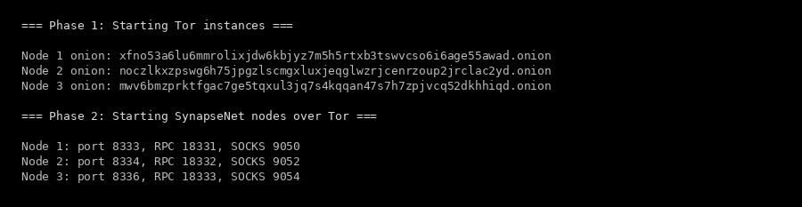
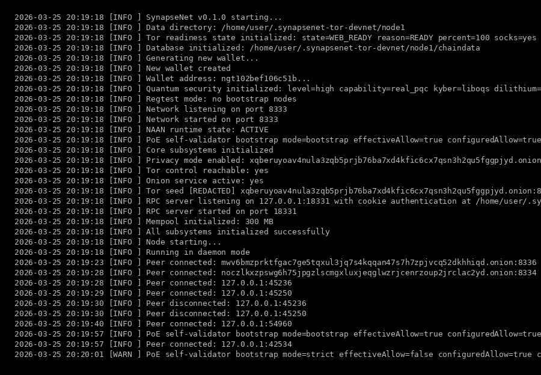
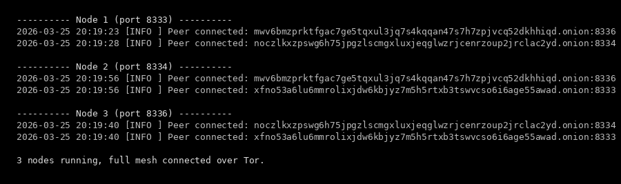
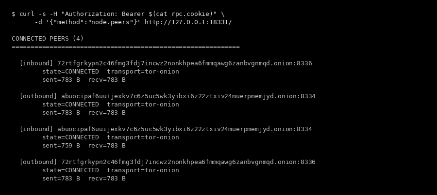
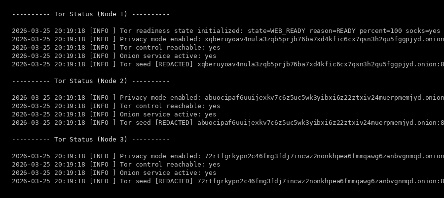

<h1 align="center">SynapseNet 0.1.0-alphaV2</h1>

<p align="center"><strong>3-Node Devnet Over Tor — Full Mesh Discovery Through Hidden Services</strong></p>

<p align="center">
  
  
  
</p>

<p align="center">
  <a href="https://github.com/anakrypt"></a>
  <a href="https://github.com/anakrypt/Synapsenetai"></a>
  <a href="https://github.com/anakrypt/SynapseNet"></a>
  <a href="https://github.com/anakrypt/Synapsenetai/blob/main/launch_tor_devnet.sh"></a>
  <a href="https://github.com/anakrypt/Synapsenetai/tree/main/RELEASES/0.1.0-alpha"></a>
  <a href="https://github.com/anakrypt/Synapsenetai/tree/main/RELEASES/0.1.0-alphaV3"></a>
  <a href="https://github.com/anakrypt/Synapsenetai/tree/main/RELEASES"></a>
</p>

---

> Three SynapseNet nodes built from source, connected exclusively through Tor hidden services. Every peer address is a `.onion`. Transport is `tor-onion`. Zero clearnet. All output below is real — captured from a live test run on March 25, 2026.

---

## What Changed from 0.1.0-alpha

| 0.1.0-alpha | 0.1.0-alphaV2 |
|-------------|---------------|
| 3 nodes on localhost (127.0.0.1) | 3 nodes over Tor hidden services |
| Direct TCP connections | All P2P routed through Tor SOCKS5 |
| Peers see each other's IP | Peers see only `.onion` addresses |
| `--seednode 127.0.0.1:PORT` | `--seednode ONION.onion:PORT` |
| No Tor requirement | `agent.tor.required=true`, clearnet fallback disabled |

---

## Tor Bootstrap

<p align="center">
  
</p>

Three separate Tor instances started, each with its own `HiddenServiceDir`. Onion addresses generated:

```
Node 1: xfno53a6lu6mmrolixjdw6kbjyz7m5h5rtxb3tswvcso6i6age55awad.onion
Node 2: noczlkxzpswg6h75jpgzlscmgxluxjeqglwzrjcenrzoup2jrclac2yd.onion
Node 3: mwv6bmzprktfgac7ge5tqxul3jq7s4kqqan47s7h7zpjvcq52dkhhiqd.onion
```

---

## Node Boot

<p align="center">
  
</p>

Real log output from Node 1. Key lines:

- `Privacy mode enabled: xqberuyoav4nula3zqb5prjb76ba7xd4kfic6cx7qsn3h2qu5fggpjyd.onion`
- `Tor control reachable: yes`
- `Onion service active: yes`
- `Peer connected: mwv6bmzprktfgac7ge5tqxul3jq7s4kqqan47s7h7zpjvcq52dkhhiqd.onion:8336`
- `Peer connected: noczlkxzpswg6h75jpgzlscmgxluxjeqglwzrjcenrzoup2jrclac2yd.onion:8334`

Each node creates its own onion service via Tor's control port (`ADD_ONION`), then connects outbound to the other two nodes' `.onion` addresses through SOCKS5.

---

## Peers — Full Mesh Over Tor

<p align="center">
  
</p>

All three nodes found each other exclusively through `.onion` addresses:

- Node 1 → Node 2 (`.onion:8334`) + Node 3 (`.onion:8336`)
- Node 2 → Node 1 (`.onion:8333`) + Node 3 (`.onion:8336`)
- Node 3 → Node 1 (`.onion:8333`) + Node 2 (`.onion:8334`)

Full mesh. Six `.onion` peer connections total across the network.

---

## RPC Peer Info

<p align="center">
  
</p>

RPC output from Node 1 showing 4 connected peers — 2 outbound, 2 inbound. Every peer shows:

- `transport=tor-onion`
- `state=CONNECTED`
- `.onion` display addresses

---

## Tor Status

<p align="center">
  
</p>

All three nodes confirm:

- `Privacy mode enabled` with unique `.onion` addresses
- `Tor control reachable: yes`
- `Onion service active: yes`

---

## How to Run

```bash
# 1. Install Tor
sudo apt-get install tor    # Ubuntu/Debian
brew install tor            # macOS

# 2. Build SynapseNet
git clone https://github.com/anakrypt/Synapsenetai.git
cd Synapsenetai
cmake -S KeplerSynapseNet -B KeplerSynapseNet/build -G Ninja \
  -DCMAKE_BUILD_TYPE=Release -DUSE_LLAMA_CPP=ON -DUSE_SECP256K1=ON
cmake --build KeplerSynapseNet/build --parallel $(nproc)

# 3. Launch 3-node Tor devnet
chmod +x launch_tor_devnet.sh
./launch_tor_devnet.sh
```

<p align="center">
  <a href="https://github.com/anakrypt/Synapsenetai/blob/main/launch_tor_devnet.sh"></a>
</p>

---

<p align="center">
  <a href="https://github.com/anakrypt"></a>
  <a href="https://github.com/anakrypt/Synapsenetai"></a>
</p>

<p align="center">
  If you find this project worth watching — even if you can't contribute code — you can help keep it going.<br>
  Donations go directly toward VPS hosting for seed nodes, build infrastructure, and development time.
</p>

<p align="center">
  <a href="https://www.blockchain.com/btc/address/bc1q5pkemq7q84ld4rf5kwtafp7jfl9dlf3pc4z9d4"></a>
</p>
