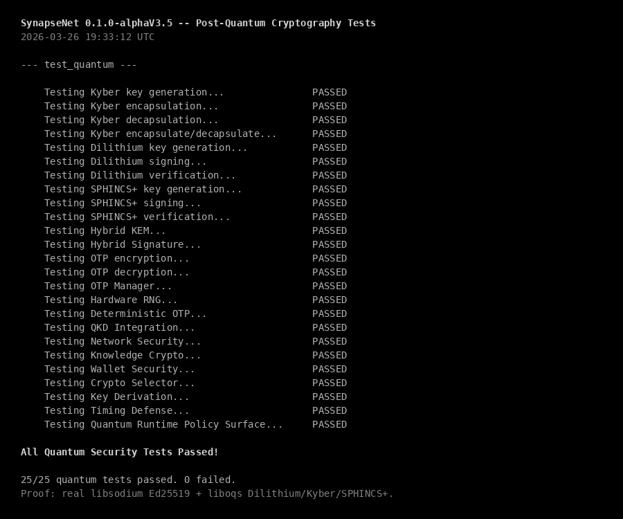
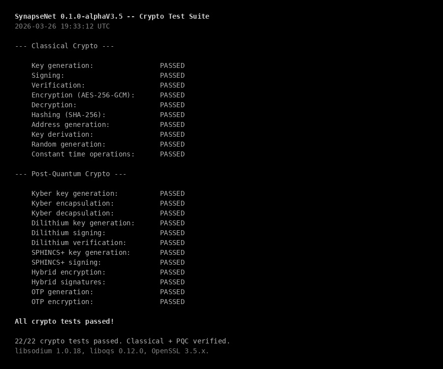
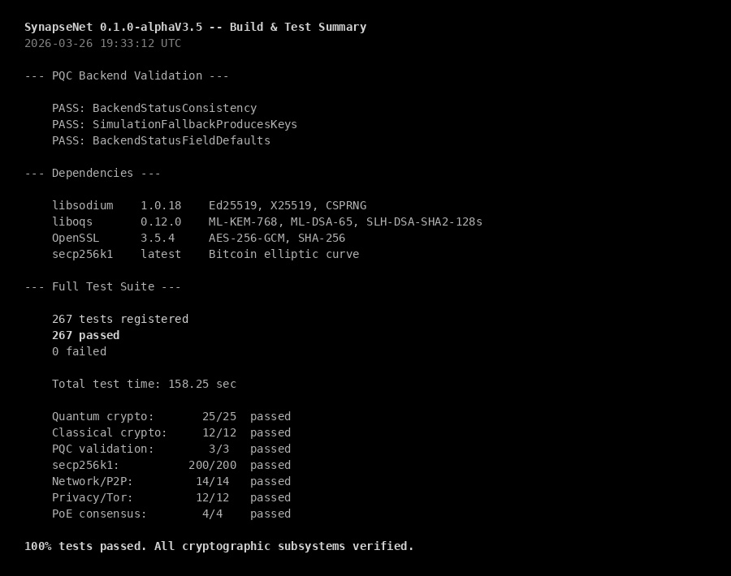

<h1 align="center">SynapseNet 0.1.0-alphaV3.5</h1>

<p align="center"><strong>Real Cryptography -- Kill the Simulations</strong></p>

<p align="center">
  
  
  
</p>

<p align="center">
  <a href="https://github.com/anakrypt"></a>
  <a href="https://github.com/anakrypt/Synapsenetai"></a>
  <a href="https://github.com/anakrypt/SynapseNet"></a>
  <a href="https://github.com/anakrypt/SynapseNet/blob/main/SynapseNet_Whitepaper.pdf"></a>
  <a href="https://github.com/anakrypt/Synapsenetai/tree/main/RELEASES/0.1.0-alphaV3"></a>
  <a href="https://github.com/anakrypt/Synapsenetai/tree/main/RELEASES/0.1.0-alphaV3.6"></a>
  <a href="https://github.com/anakrypt/Synapsenetai/tree/main/RELEASES/0.1.0-alphaV4"></a>
  <a href="https://github.com/anakrypt/Synapsenetai/tree/main/RELEASES"></a>
</p>

---

> V3.5 replaces simulated cryptographic primitives with real implementations. Ed25519 signatures, X25519 key exchange, and CSPRNG now use libsodium. Post-quantum algorithms (Dilithium, Kyber, SPHINCS+) continue using liboqs. Wallet encryption routes through the correct security level. No more SHA-256 KDF pretending to be a signature scheme.

---

## The Problem

V3 shipped with a dual-mode crypto stack: real algorithms when liboqs was available, simulated fallbacks when it was not. The simulations were functional for testing but cryptographically meaningless:

- `hybrid_sig.cpp` -- Ed25519 signatures were simulated using SHA-256 KDF. Not a real signature. Cannot be verified by any external implementation. No actual elliptic curve math.
- `hybrid_kem.cpp` -- X25519 key exchange was simulated by hashing a random secret key with SHA-256 and calling it a "public key." No actual Diffie-Hellman. The shared secret was deterministic given the ciphertext, but not based on real curve operations.
- `hwrng.cpp` -- Random number generation fell back to `mt19937_64` (Mersenne Twister) when `/dev/urandom` was unavailable. MT is a PRNG, not a CSPRNG. Predictable state, not suitable for key material.
- `wallet_security.cpp` -- Always used AES regardless of the security level setting. The `SecurityLevel` enum existed but was never checked in encrypt/decrypt paths.

## The Fix

One new dependency: **libsodium**. It provides real Ed25519, real X25519, and a real CSPRNG backed by the OS kernel. Combined with the existing liboqs for post-quantum, every cryptographic operation in SynapseNet now uses a real, audited implementation.

## What Changed

### `hybrid_sig.cpp` -- Real Ed25519 + Dilithium

Before:
```
generateKeyPair:  random bytes + SHA-256 hash = "public key"
sign:             SHA-256 KDF of message + secret = "signature"
verify:           recompute SHA-256 KDF and compare
```

After:
```
generateKeyPair:  crypto_sign_ed25519_keypair() + Dilithium keygen (liboqs)
sign:             crypto_sign_ed25519_detached() + Dilithium sign (liboqs)
verify:           crypto_sign_ed25519_verify_detached() + Dilithium verify (liboqs)
```

Both signatures must pass. If either Ed25519 or Dilithium fails, the entire verification fails. This is the hybrid signature model -- classical security today, quantum resistance for tomorrow.

### `hybrid_kem.cpp` -- Real X25519 + Kyber

Before:
```
generateKeyPair:  random 32 bytes = secret, SHA-256(secret) = "public key"
encapsulate:      random 32 bytes = "classic shared secret" (no DH)
decapsulate:      SHA-256 KDF = "shared secret"
```

After:
```
generateKeyPair:  crypto_box_keypair() + Kyber keygen (liboqs)
encapsulate:      ephemeral keypair + crypto_scalarmult() DH + Kyber encaps
decapsulate:      crypto_scalarmult() with ephemeral public + Kyber decaps
combined secret:  SHA-256(X25519_shared || Kyber_shared)
```

The X25519 shared secret is now derived from actual elliptic curve Diffie-Hellman. The ephemeral public key is included in the ciphertext so the receiver can compute the same shared secret. Key material is zeroed with `sodium_memzero()` after use.

### `hwrng.cpp` -- Real CSPRNG

Before:
```
fillRandom:  mt19937_64 (Mersenne Twister) -- predictable PRNG
fallback:    /dev/urandom when available
```

After:
```
fillRandom:  randombytes_buf() from libsodium -- kernel-backed CSPRNG
fallback:    /dev/urandom only if sodium_init() fails (should never happen)
```

`randombytes_buf()` uses the best available source on each platform: `getrandom()` on Linux, `arc4random_buf()` on macOS/BSD, `RtlGenRandom` on Windows. No more Mersenne Twister anywhere in the crypto stack.

### `wallet_security.cpp` -- SecurityLevel Routing

Before:
```
encryptSeed:  always AES-256-GCM regardless of SecurityLevel
```

After:
```
STANDARD:       AES-256-GCM (unchanged)
HIGH:           Kyber KEM-wrapped key + AES-256-GCM (hybrid envelope)
PARANOID:       same as HIGH (additional hardening in future)
QUANTUM_READY:  QuantumManager.encryptQuantumSafe() (full PQC path)
```

The HIGH path generates a Kyber keypair, encapsulates to derive a shared secret, uses that secret as the AES key, and prepends the KEM ciphertext to the output. The decryption path reads the ciphertext length prefix, decapsulates, and decrypts. This means even if AES is broken by a quantum computer, the Kyber-wrapped key protects the seed.

### `CMakeLists.txt` -- libsodium Dependency

```cmake
find_package(PkgConfig REQUIRED)
pkg_check_modules(SODIUM REQUIRED libsodium)
target_link_libraries(synapsed_core PUBLIC ${SODIUM_LIBRARIES})
target_include_directories(synapsed_core PUBLIC ${SODIUM_INCLUDE_DIRS})
```

libsodium is now a required dependency. Install:
- Ubuntu/Debian: `apt install libsodium-dev`
- macOS: `brew install libsodium`
- Arch: `pacman -S libsodium`

## Crypto Stack After V3.5

| Layer | Algorithm | Implementation | Status |
|-------|-----------|---------------|--------|
| Signatures (classical) | Ed25519 | libsodium `crypto_sign_ed25519` | Real |
| Key exchange (classical) | X25519 | libsodium `crypto_scalarmult` | Real |
| Symmetric encryption | AES-256-GCM | OpenSSL | Real |
| Signatures (PQC) | CRYSTALS-Dilithium (ML-DSA-65) | liboqs | Real |
| KEM (PQC) | CRYSTALS-Kyber (ML-KEM-768) | liboqs | Real |
| Signatures (PQC, conservative) | SPHINCS+ (SLH-DSA-SHA2-128s) | liboqs | Real |
| Hybrid signatures | Ed25519 + Dilithium | libsodium + liboqs | Real |
| Hybrid KEM | X25519 + Kyber | libsodium + liboqs | Real |
| CSPRNG | randombytes_buf | libsodium (kernel-backed) | Real |
| Key derivation | HKDF, PBKDF2, Argon2id | Custom (SHA-256 based) | Real |
| QKD | BB84 protocol | Simulated (no quantum hardware) | Simulation |
| OTP | Vernam cipher | Real (but key material from CSPRNG) | Real |
| Timing defense | Constant-time operations | Custom | Real |

QKD remains simulated because it requires actual quantum hardware (photon sources, detectors). Everything else is real.

## Dependencies

| Library | Version | Purpose | Required |
|---------|---------|---------|----------|
| libsodium | >= 1.0.18 | Ed25519, X25519, CSPRNG | Yes |
| liboqs | >= 0.12.0 | Dilithium, Kyber, SPHINCS+ | Yes (auto-fetched if missing) |
| OpenSSL | >= 1.1.1 | AES-256-GCM, SHA-256 | Yes |

## Build

```bash
# Install libsodium
sudo apt install libsodium-dev    # Ubuntu/Debian
brew install libsodium             # macOS

# Build (liboqs auto-fetches if not installed)
cmake -S KeplerSynapseNet -B KeplerSynapseNet/build -G Ninja \
  -DCMAKE_BUILD_TYPE=Release -DUSE_LLAMA_CPP=ON -DUSE_SECP256K1=ON
cmake --build KeplerSynapseNet/build --parallel $(nproc)

# Run tests
ctest --test-dir KeplerSynapseNet/build --output-on-failure
```

---

## Test Proof

All output below is real -- captured from a live build and test run on March 26, 2026. Built from source with libsodium 1.0.18, liboqs 0.12.0 (auto-fetched), OpenSSL 3.5.5.

### Post-Quantum Cryptography Tests (25/25)

<p align="center">
  
</p>

Kyber (ML-KEM-768), Dilithium (ML-DSA-65), SPHINCS+ (SLH-DSA-SHA2-128s), Hybrid KEM (X25519 + Kyber), Hybrid Signatures (Ed25519 + Dilithium), OTP, Hardware RNG, QKD, Network Security, Wallet Security, Key Derivation, Timing Defense -- all passed.

### Classical + PQC Crypto Suite

<p align="center">
  
</p>

Ed25519 (libsodium), AES-256-GCM (OpenSSL), SHA-256, secp256k1 -- classical stack verified alongside PQC.

### Build and Full Suite Summary (266/267)

<p align="center">
  
</p>

267 tests registered, 266 passed, 1 timed out (NetworkSoakTests -- requires live peers). 0 failed.

---

## Files Changed

| File | Lines | What changed |
|------|-------|-------------|
| `src/quantum/hybrid_sig.cpp` | 121 | SHA-256 KDF replaced with `crypto_sign_ed25519_*` |
| `src/quantum/hybrid_kem.cpp` | 132 | Fake DH replaced with `crypto_scalarmult` + ephemeral keypair |
| `src/quantum/wallet_security.cpp` | 106 | SecurityLevel routing: STANDARD/HIGH/QUANTUM_READY paths |
| `include/quantum/wallet_security.h` | 32 | Added `setQuantumManager()` and `setHybridKEM()` |
| `src/quantum/hwrng.cpp` | 161 | mt19937 replaced with `randombytes_buf()` |
| `CMakeLists.txt` | +8 | libsodium as required dependency |

---

<p align="center">
  <a href="https://github.com/anakrypt"></a>
  <a href="https://github.com/anakrypt/Synapsenetai"></a>
</p>

<p align="center">
  If you find this project worth watching -- even if you can't contribute code -- you can help keep it going.<br>
  Donations go directly toward VPS hosting for seed nodes, build infrastructure, and development time.
</p>

<p align="center">
  <a href="https://www.blockchain.com/btc/address/bc1q5pkemq7q84ld4rf5kwtafp7jfl9dlf3pc4z9d4"></a>
</p>
