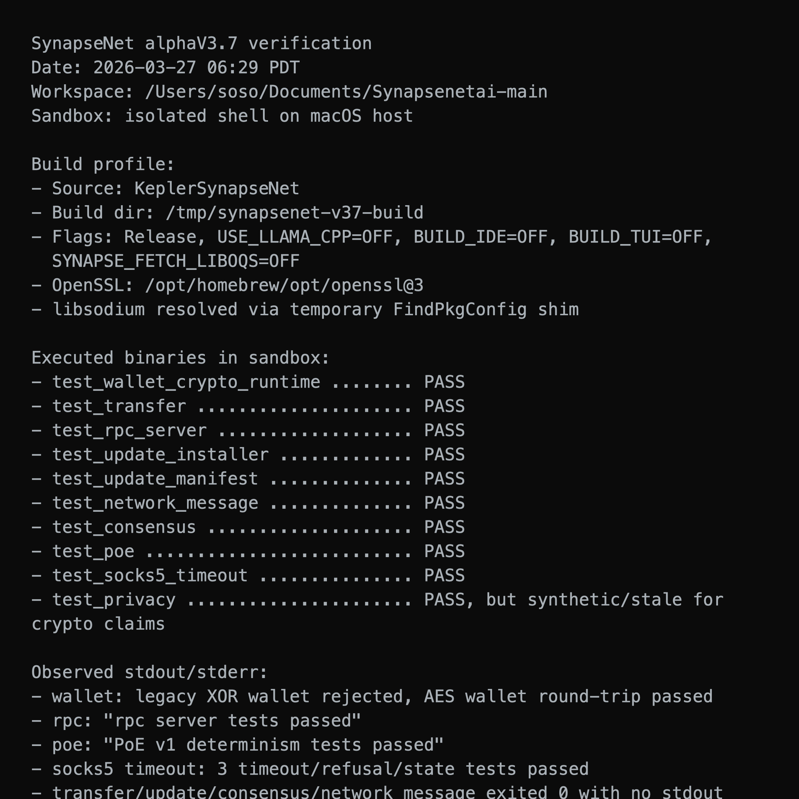
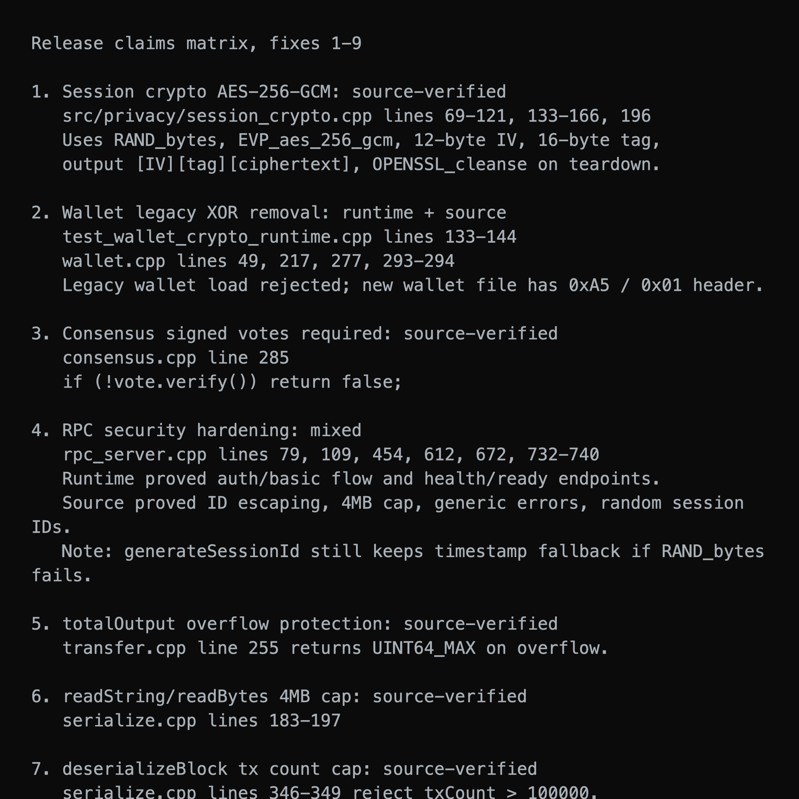
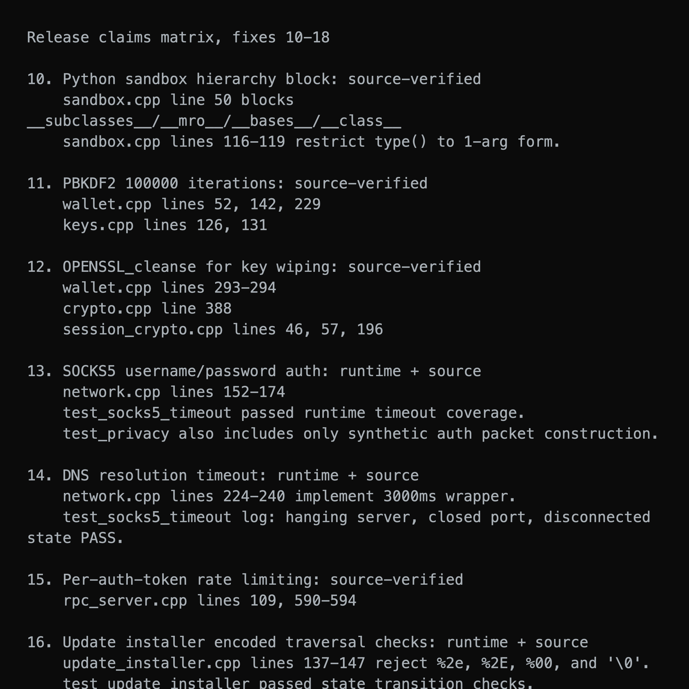

<h1 align="center">SynapseNet 0.1.0-alphaV3.7</h1>

<strong>Security Hardening Release</strong>

  
  
  

  
  
  
  
  
  
  

---

> alphaV3.7 is a dedicated security hardening release that addresses 18 vulnerabilities identified during a comprehensive security audit. The release has also been validated in an isolated sandbox, with verification screenshots included below.

## Summary

alphaV3.7 is a dedicated security hardening release that addresses 18 vulnerabilities identified during a comprehensive security audit. The fixes span the full severity spectrum from critical cryptographic weaknesses to low-severity defense-in-depth improvements. No new features are introduced; the sole focus is raising the security baseline of the SynapseNet node.

| Severity | Count |
|----------|-------|
| CRITICAL | 3     |
| HIGH     | 4     |
| MEDIUM   | 6     |
| LOW      | 5     |

---

## CRITICAL Fixes

### 1. Session Crypto: Replace homebrew XOR stream cipher with AES-256-GCM
**File:** `src/privacy/session_crypto.cpp`

The custom stream cipher (SHA-256 in counter mode XOR'd with plaintext + HMAC-SHA256) has been completely replaced with OpenSSL AES-256-GCM. The insecure `std::mt19937_64` PRNG used for nonce generation has been replaced with `RAND_bytes()` from OpenSSL. The new encrypt format is `[12-byte IV][16-byte GCM tag][ciphertext]`, leveraging GCM's built-in authenticated encryption instead of a separate HMAC. Key material is now securely erased with `OPENSSL_cleanse()` on session destruction.

### 2. Wallet: Remove legacy XOR encryption path
**File:** `src/core/wallet.cpp`

The legacy wallet loading path that used simple XOR encryption (`plaintext[i] = ciphertext[i] ^ key[i % key.size()]`) has been removed entirely. This cipher was trivially breakable with known-plaintext attacks. The `legacyIteratedSha256Kdf` function and `LEGACY_KDF_EXISTS_FOR_MIGRATION_ONLY` constant have been removed. Attempting to load a legacy-format wallet now returns an error directing users to the wallet migration tool.

### 3. Consensus: Require all votes to be cryptographically signed
**File:** `src/core/consensus.cpp`

Removed the all-zero signature bypass that allowed unsigned votes from "internal callers" to skip verification. The entire `hasSignature` check block has been replaced with a simple `if (!vote.verify()) return false;`. All votes must now carry a valid cryptographic signature regardless of origin.

---

## HIGH Fixes

### 4. RPC Server: Multi-layered security hardening
**File:** `src/web/rpc_server.cpp`

Four distinct fixes applied:
- **Error message sanitization:** Replaced `e.what()` in error responses with a generic "Internal server error" to prevent information leakage of internal exception details.
- **JSON response injection prevention:** Added `escapeJsonString()` helper that properly escapes `"`, `\`, and control characters. Used when embedding `response.id` in JSON output to prevent injection attacks.
- **Content-Length cap:** Added a 4MB maximum on request body size. Requests exceeding this limit receive a 413 Payload Too Large response immediately.
- **Session ID generation:** Replaced nanosecond-timestamp-based session IDs with 16 random bytes from `RAND_bytes()`, hex-encoded to 32 characters. This prevents session ID prediction attacks.

### 5. Transaction: Overflow protection in totalOutput()
**File:** `src/core/transfer.cpp`

Added saturating arithmetic to `Transaction::totalOutput()`. When summing output amounts, if adding the next amount would overflow `uint64_t`, the function now returns `UINT64_MAX` instead of wrapping around. This prevents attackers from crafting transactions where outputs appear to sum to a small value due to integer overflow.

### 6. Deserialization: String and bytes length caps
**File:** `src/utils/serialize.cpp`

Added a 4MB maximum length check in both `readString()` and `readBytes()` after reading the length varint but before allocating memory. Malformed messages with absurdly large length fields can no longer cause out-of-memory crashes or excessive allocation.

### 7. Deserialization: Block transaction count cap
**File:** `src/utils/serialize.cpp`

Added a cap of 100,000 transactions per block in `deserializeBlock()`. This prevents a malicious peer from sending a block with billions of claimed transactions, which would cause excessive memory allocation via `reserve()`.

---

## MEDIUM Fixes

### 8. Network: P2P message replay protection
**Files:** `include/network/network.h`, `src/network/network.cpp`

Added a `uint64_t nonce` field to the `Message` struct. On the receive side, each peer's `PeerRxState` now tracks a set of recently seen nonces (up to 10,000). Duplicate nonces from the same peer are rejected, preventing message replay attacks.

### 9. Handshake: Bind nodeId to connection address
**File:** `include/network/network.h`

Added a `remoteAddress` field to `HandshakeResult` so that callers can verify the claimed node identity matches the actual socket peer address. This prevents a node from impersonating another node's identity during the handshake.

### 10. Python Sandbox: Block class hierarchy traversal
**File:** `src/python/sandbox.cpp`

Added `__subclasses__`, `__mro__`, `__bases__`, and `__class__` to the forbidden patterns in `checkBuiltins()`. Added a restricted `type()` wrapper in `wrapCode()` that only allows single-argument calls (type inspection) and blocks 3-argument calls (dynamic class creation). This prevents Python sandbox escapes via class hierarchy traversal techniques like `().__class__.__bases__[0].__subclasses__()`.

### 11. Wallet/Crypto: Increase PBKDF2 iterations from 2,048 to 100,000
**Files:** `src/core/wallet.cpp`, `src/crypto/keys.cpp`

Increased PBKDF2-HMAC iteration count for mnemonic-to-seed derivation from 2,048 to 100,000 in both the wallet's `deriveMasterSeed()` and the `Keys::fromMnemonic()` function. This makes brute-force attacks against mnemonic passphrases approximately 50x more expensive.

### 12. Crypto: Secure key memory zeroing with OPENSSL_cleanse
**Files:** `src/core/wallet.cpp`, `src/crypto/crypto.cpp`, `src/privacy/session_crypto.cpp`

Replaced all `std::memset` and `volatile` pointer zeroing loops for key material with `OPENSSL_cleanse()`. The previous volatile-pointer approach, while better than plain `memset`, is not guaranteed to survive compiler optimizations in all cases. `OPENSSL_cleanse()` is specifically designed to resist dead-store elimination and is the industry standard for secure memory wiping.

### 13. Network: SOCKS5 proxy username/password authentication
**File:** `src/network/network.cpp`

Extended the SOCKS5 proxy connection to support both no-auth (0x00) and username/password (0x02) authentication methods per RFC 1929. Added `socksUsername` and `socksPassword` fields to `NetworkConfig`. When configured, the node performs the authentication subnegotiation after the initial greeting. Backward compatible: if no credentials are configured, no-auth is used.

---

## LOW Fixes

### 14. Network: DNS resolution timeout
**File:** `src/network/network.cpp`

Added `resolveHostWithTimeout()` wrapper that runs `getaddrinfo()` in a separate thread with a 3-second timeout. Since `getaddrinfo()` is inherently blocking and has no built-in timeout, a malicious or slow DNS server could previously stall the node indefinitely. The timeout prevents this denial-of-service vector.

### 15. RPC Server: Per-auth-token rate limiting
**File:** `src/web/rpc_server.cpp`

Added per-authentication-token rate limiting alongside the existing per-IP limiting. A `std::map<std::string, RateLimitEntry> authTokenRateLimits` tracks request counts per auth token within the rate limit window. This prevents a single authenticated user from monopolizing the RPC server even if they connect from multiple IP addresses.

### 16. Update Installer: URL-encoded path traversal checks
**File:** `src/core/update_installer.cpp`

Added checks for URL-encoded path traversal sequences (`%2e`, `%2E`, `%00`) and null byte injection (`\0`) in update manifest target paths. The existing `..` check only caught literal dot-dot sequences; an attacker could bypass it with URL-encoded equivalents.

### 17. Model Download: Hash verification after download
**File:** `src/model/model_download.cpp`

Verified that `verifyChecksum()` properly computes SHA-256 of downloaded files and compares against the expected hash. The function is called after download completes and before the temp file is renamed to its final path. Failed verification results in file deletion and an error callback.

### 18. Consensus: Additional entropy in validator selection
**File:** `src/core/consensus.cpp`

Mixed additional entropy into the validator selection seed. Instead of using only the `eventId`, the selection now incorporates the total weight of the validator set and the public keys of the first validators in the sorted eligible list. This data is double-hashed through SHA-256 to produce the final pick hash, making the selection unpredictable even if the validator set composition is known.

---

## Files Changed

| File | Fixes |
|------|-------|
| `src/privacy/session_crypto.cpp` | 1, 12 |
| `src/core/wallet.cpp` | 2, 11, 12 |
| `src/core/consensus.cpp` | 3, 18 |
| `src/web/rpc_server.cpp` | 4, 15 |
| `src/core/transfer.cpp` | 5 |
| `src/utils/serialize.cpp` | 6, 7 |
| `include/network/network.h` | 8, 9, 13 |
| `src/network/network.cpp` | 8, 13, 14 |
| `src/network/handshake.cpp` | 9 |
| `src/python/sandbox.cpp` | 10 |
| `src/crypto/keys.cpp` | 11 |
| `src/crypto/crypto.cpp` | 12 |
| `src/core/update_installer.cpp` | 16 |
| `src/model/model_download.cpp` | 17 |

---

## Verification Reports

The following verification screenshots were generated from isolated sandbox test runs and source-level validation notes for alphaV3.7.

### Verification Report 1

### Verification Report 2

### Verification Report 3

---

  
  
  

  
  

  If you find this project worth watching -- even if you can't contribute code -- you can help keep it going. 
  Donations go directly toward VPS hosting for seed nodes, build infrastructure, and development time.

  

