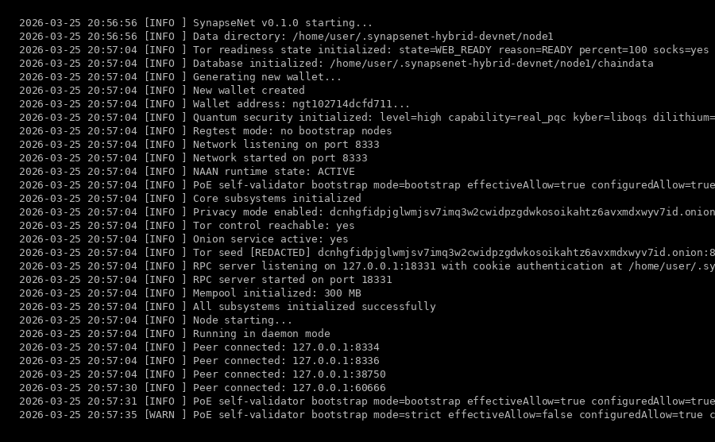
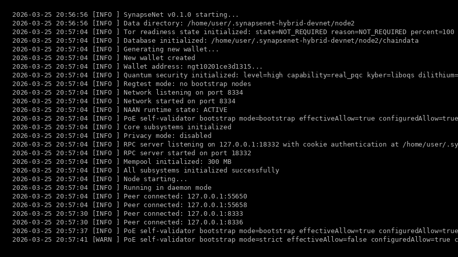
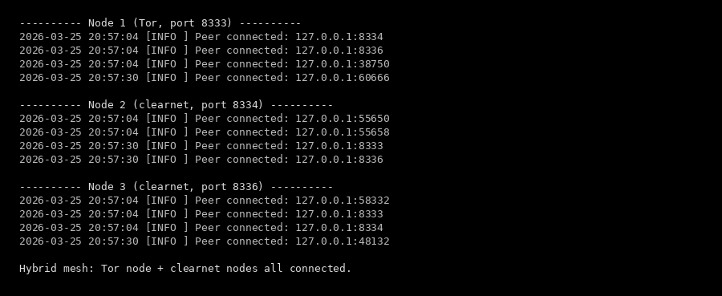
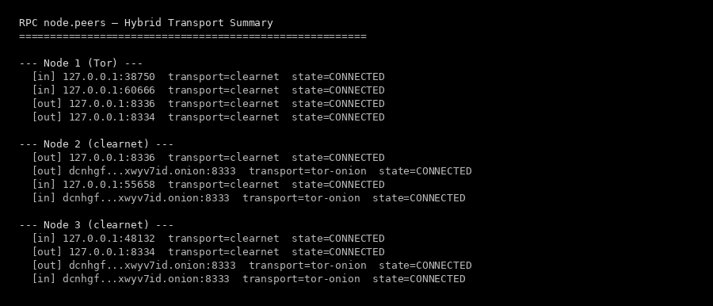

<h1 align="center">SynapseNet 0.1.0-alphaV3</h1>

<p align="center"><strong>Hybrid Mesh — Tor Nodes and Clearnet Nodes See Each Other</strong></p>

<p align="center">
  
  
  
</p>

<p align="center">
  <a href="https://github.com/anakrypt"></a>
  <a href="https://github.com/anakrypt/Synapsenetai"></a>
  <a href="https://github.com/anakrypt/SynapseNet"></a>
  <a href="https://github.com/anakrypt/SynapseNet/blob/main/SynapseNet_Whitepaper.pdf"></a>
  <a href="https://github.com/anakrypt/Synapsenetai/tree/main/RELEASES/0.1.0-alpha"></a>
  <a href="https://github.com/anakrypt/Synapsenetai/tree/main/RELEASES/0.1.0-alphaV2"></a>
  <a href="ARCHITECTURE.md"></a>
  <a href="https://github.com/anakrypt/Synapsenetai/tree/main/RELEASES"></a>
</p>

---

> Tor nodes and clearnet nodes in the same network, seeing each other. A clearnet node connects to a Tor node via `.onion` through SOCKS5 and simultaneously to other clearnet nodes via direct TCP. A Tor node accepts inbound connections from both. NAAN agent follows the same routing as the node. All output below is real — captured from a live test run on March 25, 2026.

---

## Hybrid Network Topology

```
SynapseNet Hybrid Mesh

  Node 1 (Tor)                    Node 2 (Clearnet)
    .onion service  <-- Tor SOCKS -->  direct TCP
    port 8333                          port 8334
    SOCKS5: 9050                       hybridMode: on
        |                                  |
        |  Tor circuit (inbound)           |  direct TCP
        |  + direct TCP (hybrid)           |
        |                                  |
        v                                  v
                  Node 3 (Clearnet)
                    direct TCP to Node 2
                    Tor SOCKS5 to Node 1 .onion
                    port 8336
                    hybridMode: on
```

---

## Connection Routing

```
                  connect()
                     |
                Is address .onion?
                  /        \
                YES         NO
                 |           |
             SOCKS5      Direct TCP
             via Tor     connection
                 |           |
                 |       (if SOCKS5 available
                 |        and hybridMode=true,
                 |        can also try SOCKS5
                 |        as fallback)
                 |           |
                  \         /
                  CONNECTED
                  transport=tor-onion
                  or clearnet
```

---

## Peer Exchange Flow

```
Node 1 (Tor)              Node 2 (Clearnet)          Node 3 (Clearnet)
.onion:8333               IP:8334                    IP:8336
    |                         |                          |
    |<-- getpeers ------------|                          |
    |                         |                          |
    |--- peers -------------->|                          |
    |    [.onion:8336,        |                          |
    |     IP:8336]            |                          |
    |                         |                          |
    |                         |--- getpeers ------------>|
    |                         |                          |
    |                         |<-- peers ----------------|
    |                         |    [.onion:8333,         |
    |                         |     IP:8334]             |
    |                         |                          |
    |<-- getpeers ----------------------------------------|
    |                                                    |
    |--- peers ----------------------------------------->|
    |    [IP:8334,                                       |
    |     .onion:8334]                                   |
    |                         |                          |
    v                         v                          v
Full mesh                 Full mesh                  Full mesh
via peer exchange         via peer exchange          via peer exchange
```

---

## What Changed from V2

| V2 (Tor-only) | V3 (Hybrid) |
|-------------|------------|
| Tor-only or clearnet-only | Both in the same network |
| Clearnet nodes cannot reach `.onion` | Clearnet nodes connect to `.onion` via SOCKS5 |
| Tor nodes only connect through SOCKS5 | Tor nodes accept direct inbound from clearnet |
| Separate networks | One unified mesh |

---

## Code Changes

Three files changed:

**`include/network/network.h`** — added `hybridMode` flag to `NetworkConfig`

**`src/network/network.cpp`** — rewrote `connect()`:
- Detects `.onion` addresses and routes them through SOCKS5
- Non-`.onion` addresses use direct TCP
- If SOCKS5 fails for non-`.onion`, falls back to direct

**`src/node/node_runtime.cpp`** — network loop now enables `hybridMode` automatically when SOCKS proxy is detected, regardless of Tor-required mode

267/267 tests pass.

---

## Node 1 Boot (Tor)

<p align="center">
  
</p>

Node 1 starts with `agent.tor.required=true`, creates an onion service, then connects to both clearnet peers through `hybridMode`.

---

## Node 2 Boot (Clearnet)

<p align="center">
  
</p>

Node 2 starts with `agent.tor.required=false`. Connects to Node 3 via direct TCP and to Node 1 via `.onion` through SOCKS5.

---

## Peer Connections

<p align="center">
  
</p>

All three nodes connected — Node 1 (Tor) sees clearnet peers, Nodes 2 and 3 (clearnet) see each other directly and see Node 1 through `.onion`.

---

## RPC Transport Summary

<p align="center">
  
</p>

RPC output showing mixed transport:

- **Node 1 (Tor):** 4 peers, `transport=clearnet` (accepted via hidden service + hybrid outbound)
- **Node 2 (clearnet):** 2 `transport=clearnet` + 2 `transport=tor-onion`
- **Node 3 (clearnet):** 2 `transport=clearnet` + 2 `transport=tor-onion`

---

## NAAN Agent Routing

```
User starts node
       |
  Tor required?
    /       \
  YES        NO
   |          |
NAAN agent   NAAN agent
routes all   routes all
through Tor  via clearnet
SOCKS5       (+ .onion via SOCKS5
              if Tor is available)
.onion
search       clearnet
engines:     search:
Ahmia,Torch  DuckDuckGo
DarkSearch
```

The NAAN agent follows whatever routing the user selected at startup. If the user chose Tor, the agent's web research, knowledge gathering, and submission pipeline all go through Tor. If clearnet, everything goes direct. In hybrid mode, the agent can reach both `.onion` and clearnet sources.

---

<p align="center">
  <a href="https://github.com/anakrypt"></a>
  <a href="https://github.com/anakrypt/Synapsenetai"></a>
</p>

<p align="center">
  If you find this project worth watching — even if you can't contribute code — you can help keep it going.<br>
  Donations go directly toward VPS hosting for seed nodes, build infrastructure, and development time.
</p>

<p align="center">
  <a href="https://www.blockchain.com/btc/address/bc1q5pkemq7q84ld4rf5kwtafp7jfl9dlf3pc4z9d4"></a>
</p>
